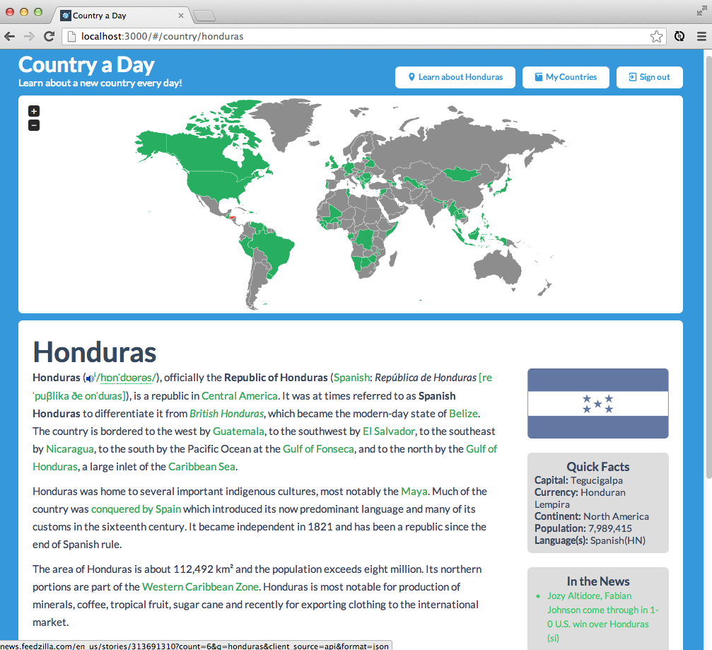

# Country a Day
CountryaDay.org is a simple web app that gives you a different country to learn about each day.  It provides some introductory information from various web services as a basis for you to begin learning about your country of the day.

## Services & Libraries
Big thanks to the following awesome services and libraries:
- [Wikipedia](http://wikipedia.org) - Country summary paragraphs
- [Feedzilla](http://feedzilla.com) - Countries "in the news"
- [Geonames](http://geonames.org) - Additional Country info
- [JVectorMap](http://jvectormap.com)
- Angularjs
- Everything in my [Gemfile](Gemfile)

## Contributing
* Open an issue for a:
    * bug or usage problem
    * feature request
    * general suggestion
* If you would like to contribute code, awesome!  The first step would be probably be opening an issue as well.
This allows us to discuss it and not duplicate anyone's efforts.

### Known Issues
1. Countries featured are incomplete or inaccurate.  At some point these should be standardized to countries 
recognized by the UN or something like that. In the intrest of saving some time, I took the default world map
from the J Vector Map library.
2.  It would be nice to provide additional learning resources for each country, even if they are just links.
3.  The Guardfile setup needs work.
4.  Javascript tests need major work.
5.  Singapore is missing from the map.
